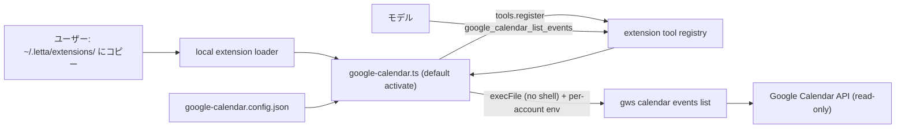

# 実装計画: gws (googleworkspace/cli) を利用した Google カレンダー予定取得ツール（Extension）の追加

## 元Issue
- #2: [Feature] googleworkspace/cli を利用したカレンダー情報取得ツールを Extension として追加
- https://github.com/ryuma-1/letta-code/issues/2

## 概要
Letta Code の Extension 機構を使い，`gws` (googleworkspace/cli) を子プロセスで呼び出して Google カレンダーの予定を取得する読み取り専用ツールを追加する．
ユーザー草案に従い，複数の Google アカウントと複数のカレンダー ID を指定して取得できる設計にする．
コア（`src/extensions/extension-engine.ts` など）には手を入れず，自己完結した単一ファイルの Extension として提供する．

## 要件
- エージェントが呼べるツールとして，カレンダーの予定を取得できること．
- 読み取り専用にする．予定の作成，更新，削除は行わず，実装上も書き込み系の gws サブコマンドを呼べないようにする．
- （ユーザー草案）複数アカウント，複数カレンダー ID に対応する．
- 既存の Extension 規約を守る．
  - 単一ファイルで，`default` の activate 関数を export する．
  - `letta.capabilities.tools` でガードする．
  - `execFile` か `spawn` を使い，shell 文字列は使わない．
  - disposer を返す．
  - ツール名は `^[a-zA-Z0-9_-]{1,64}$`，かつ組み込みツールと衝突しないこと．
- リポジトリ規約を守る．
  - kebab-case の `.ts`，named export，`export function` 形式，`@/` import．
  - doc comment を主要な構造の前に付ける．
  - 新規依存は追加しない．
  - テストはソースの隣に置き，`mock.module` を使わず DI で書く．

## 実装方針

### 調査で分かった既存 Extension 機構の制約（設計に直結）
- 実際に読み込まれるのは `~/.letta/extensions/` 直下のファイルだけである．`resolveLocalExtensionSources` は global スコープのみを返す．`bundled` は型にあるだけで，読み込みは未実装．
- 読み込み時には，ファイルが `~/.letta/extension-cache/` に `.mjs` としてコピーされてから import される．そのため次の制約がある．
  - Extension は相対 import や `@/` import を使えない．
  - `node:*` などの標準 API 以外は使えない（`react` のみ symlink される）．
  - 単一ファイルで完結させる必要がある．
- `listExtensionFiles` は `Dirent.isFile()` で判定する．シンボリックリンクは対象外になる可能性が高く，配置は「コピー」が前提になる．
- `.json` は Extension として読み込まれない．設定ファイルを同じディレクトリに置いても安全である．
- ツールの `requiresApproval` の既定値は true である．読み取り専用の低リスクツールは `false`，`parallelSafe: true` にできる（`references/tools.md` の方針）．
- ツールの run コンテキストは `args`，`cwd`，`signal`，`onOutput` などを持つ．戻り値は文字列または `{status, content}` である．

### 配置とスコープ
- Extension 本体はリポジトリ内に，ユーザーが `~/.letta/extensions/` へコピーするサンプルとして同梱する（ユーザー確認済み）．
  - 候補パスは `src/extensions/examples/google-calendar.ts`．`tsc`（`include: src/**/*`）と `src/extensions` のテスト実行対象に入るため，型チェックとテストが自動で効く．
  - 配置先は実装時に確定する．
- コア側の「bundled ソース自動読み込み」対応は Issue のスコープ外として行わない．必要ならフォローアップ Issue にする．
- 単一ファイル制約の中でテスト可能にするため，次の構成にする．
  - ロジックを純粋関数として named export する（引数解決，gws 引数組み立て，結果の整形）．
  - プロセス実行は `runner` を DI できる関数にする．
  - `default export activate(letta, deps?)` の形にする．

### 設定（アカウントとカレンダー ID）
- 設定ファイルは `~/.letta/extensions/google-calendar.config.json`．環境変数 `LETTA_GOOGLE_CALENDAR_CONFIG` でパスを上書きできる．
- スキーマ案（トークンなどの秘密情報は設定ファイルに書かない）:
  - `accounts`: `{ [alias]: { configDir?: string, credentialsFile?: string, calendarIds?: string[] } }`
  - `defaultAccounts?: string[]`
  - `defaultCalendarIds?: string[]`（未指定なら `["primary"]`）
  - `gwsPath?: string`（既定は `gws`）
  - `timeoutMs?: number`
  - `maxEventsPerCalendar?: number`
  - `timeZone?: string`
- 設定は毎回の実行時に読む（または reload 時のみ読む）．不正な設定は，ツール実行時に短く行動可能なエラーとして返す．activate 時に throw して Extension 全体が診断エラーになることは避ける．
- アカウントの分離は，アカウントごとに環境変数（`GOOGLE_WORKSPACE_CLI_CONFIG_DIR` / `GOOGLE_WORKSPACE_CLI_CREDENTIALS_FILE`）を切り替えて子プロセスを起動する形にする．具体名は要検証（リスク参照）．

### ツール仕様
- ツール名: `google_calendar_list_events`（組み込みと衝突しない名前）．
- 入力スキーマ（`additionalProperties: false`）:
  - `accounts?: string[]`: 設定済みエイリアス名のみ受け付ける．未指定なら `defaultAccounts`．任意パスや任意の環境変数はモデルから渡せない．
  - `calendarIds?: string[]`: 未指定ならアカウント設定の値，なければ既定の値．
  - `timeMin?` / `timeMax?`: RFC3339．未指定なら「現在から 7 日間」．
  - `maxResults?`: 上限クランプ付き．例として 1〜250，既定 50．
  - `query?: string`: 任意．
- 呼び出し: `gws calendar events list --params '<JSON>'`．
  - JSON は `calendarId`，`timeMin`，`timeMax`，`singleEvents:true`，`orderBy:"startTime"`，`maxResults` を含む．
  - `--format json` を付ける想定で，出力形式は要検証．
  - `orderBy=startTime` は `singleEvents=true` が必須なので，固定で付ける．
- 実行: `execFile` を shell なしで使い，引数は配列で渡す．
  - `signal`（ctx.signal）を連携し，`timeout` を設定する．
  - `maxBuffer` を制限する．
  - stderr は切り詰めて返す．
  - accounts × calendarIds は並列度を制限して実行する（例: 4）．
  - 1 件の失敗は全体を落とさず，部分結果としてエラー付きで返す．
- 出力: モデル向けの整形テキスト．時系列でマージし，各予定に account，calendarId，summary，start/end，location，status，htmlLink，終日かどうかを載せる．
  - description は長さを制限する．
  - 取得件数の上限に達した場合は明記する．
  - 失敗した account/calendar は一覧で示す．
- 読み取り専用の担保:
  - サブコマンドを `["calendar", "events", "list"]` に固定し，モデル入力から gws の引数を組み立てない．
  - `--params` は JSON.stringify した値のみを渡す．
  - 「書き込み系サブコマンドを渡そうとしても実行経路が存在しない」ことをテストで確認する．
- `requiresApproval: false`，`parallelSafe: true`（ユーザー確認済み）．
- エラー処理:
  - gws が未インストール（`ENOENT`）の場合: インストール手順への案内を返す．
  - 未認証の場合: `gws auth login` の案内を返す．
  - タイムアウト，キャンセル，JSON パース失敗，未知のアカウントエイリアスの場合: 短いメッセージを返す．
  - エラーを黙って握りつぶさず，`{status:"error", content}` で明示する．

## 構成の変化

## タスク一覧
### 事前検証（実装前）
- [x] 実機の `gws` で以下を確認し，結果に応じて設計を確定する．（公式 README で代替確認済み．実機では未検証）
  - `gws calendar events list --params '{...}'` の正確な構文
  - JSON 出力フラグ
  - ページネーション（`--page-all` の有無）
  - 認証の保存場所
  - 複数アカウントの切り替え方（環境変数，config dir，`--account` 等）
  - 読み取り専用スコープ（`calendar.readonly` / `calendar.events.readonly`）でのログイン方法

### 実装
- [x] `src/extensions/examples/google-calendar.ts` を作成する（単一ファイル，`node:*` のみ使用）．
  - [x] 設定の型と読み込み，検証（型ガードで手書き，依存追加なし）
  - [x] 入力の検証と正規化（エイリアス解決，calendarIds，時間範囲の既定値，maxResults のクランプ）
  - [x] gws 引数と環境変数の組み立て（サブコマンド固定，アカウントごとの env）
  - [x] DI 可能な runner（既定は `execFile`，timeout，signal，maxBuffer）
  - [x] 並列度制限付きの account × calendar 取得と部分失敗の集約
  - [x] 予定のマージ，ソート，整形（出力サイズ制限）
  - [x] エラーの分類（未インストール，未認証，タイムアウト，不正 JSON，不明なアカウント）
  - [x] `export default function activate`（`capabilities.tools` ガード，`requiresApproval:false`，`parallelSafe:true`，disposer を返す）
  - [x] すべての主要な構造に doc comment（why を書く）を付ける
- [x] 設定ファイルの例を用意する（コメントまたはサンプル JSON．README/ドキュメントの新規作成は許可が必要なため，ファイル冒頭の doc comment に留めるか，許可を得てから追加する）．

### テスト
- [x] `src/extensions/examples/google-calendar.test.ts`（`mock.module` を使わず runner を DI）
  - [x] 引数組み立て: `--params` の JSON に calendarId，timeMin，timeMax，singleEvents，orderBy が入ること．
  - [x] 複数アカウント × 複数カレンダーの集約と時系列ソート．
  - [x] アカウントごとに環境変数が分離されること．
  - [x] 部分失敗時に結果とエラーが両方返ること．
  - [x] ENOENT，未認証，タイムアウト，不正 JSON，不明なアカウント，設定不正の各エラーメッセージ．
  - [x] maxResults のクランプと既定の時間範囲．
  - [x] 読み取り専用の担保: 実行される gws 引数が常に `calendar events list` で始まること．入力に書き込み系の文字列を混ぜても影響しないこと．
  - [x] 実際の `createExtensionEngine` / `loadLocalExtensions`（一時ディレクトリ，既存 `local-extension-loader.test.ts` と同様の方法）で読み込め，ツールが登録されること．
- [x] `bun run check`（cycles，boundaries，exported-functions，biome，tsc）を通す．

## リスク・確認事項
- 配置場所と配布方法（ユーザー確認済み: サンプル同梱 + コピー）:
  - 現行機構では Extension はユーザーの `~/.letta/extensions/` に置くファイルで，リポジトリ内の bundled 自動読み込みは未実装である．
  - コピー前提であるため，更新時は再コピーが必要になる．
- 複数アカウント（ユーザー確認済み: 最初から accounts + calendarIds の両方を実装）: gws の切り替え方式は事前検証タスクで確定する．ネイティブ対応がない場合は「アカウントごとに config dir を分ける」運用で対応する．
- gws CLI の仕様は未検証（以下はすべて要検証の仮定）:
  - 認証の保存場所と環境変数名
  - 複数アカウントを切り替える公式機能の有無と方法
  - `--params` の構文
  - JSON 出力フラグ
  - ページネーション
  - サブコマンド体系（Discovery ベースで動的に生成される）
  - 出力スキーマ
  - プレ 1.0 で破壊的変更が入る可能性．最低対応バージョンの明記とバージョン検出の要否
- スコープの過剰権限: gws の認証時に書き込み可能なスコープを付与すると，コードが読み取り専用でも認証情報自体は書き込み可能になる．`calendar.readonly` 系のスコープでログインする案内が必要．
- プライバシー: 予定の内容がモデル（外部 LLM）に送られる．承認は不要とする（ユーザー確認済み）．description は長さを制限する．
- 環境変数の扱い: 子プロセスへ渡す env は，親の env に対しアカウント設定分のみを上書きする．モデルが env を制御できないようにする．トークンを設定ファイルや出力に含めない．
- テスト対象が `src/extensions/examples/` になる点: `scripts/check-test-coverage.cjs` と `scripts/run-unit-tests.cjs` はサブディレクトリを走査するかを実装時に確認する．
- 承認フロー: `permissions/checker.ts` が拡張ツールの `requiresApproval` を参照する．`false` にした場合の挙動を確認する．
- 設定ファイル形式: JSON（`.json` は Extension として誤って読み込まれないため安全）．
